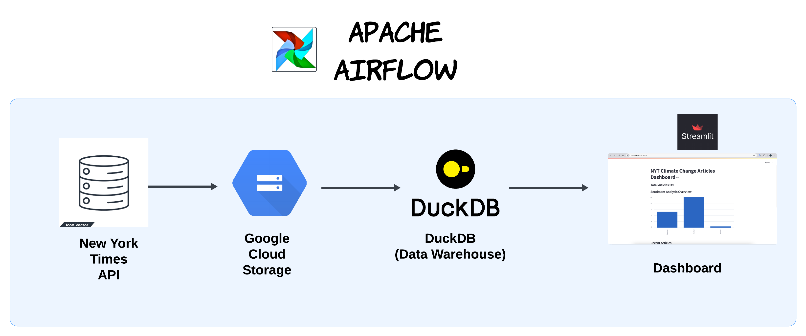

# News Sentiment Analysis for Climate Change Articles

## Aim of the project: 
The main aim is to learn and practice data engineering skills. For this I will create a data 
pipeline that gets data from The New York Times API (https://developer.nytimes.com/).
I will then analyse the sentiment of articles (positive, negative, neutral) 
and create a simple visualisation. The pipeline is set up to be a batch data 
pipeline where it can be run daily to collect most recent articles.
Some parts of the pipeline are unnecesary however are used to learn skills.

## Tech Stack used:
- Apache Airflow: orchestration tool
- Google Cloud: Cloud storage acting as a data lake
- PostgreSQL: Apache Airflow meta database
- DuckDB: the Data Warehouse
- Streamlit

Data pipeline architecture:

